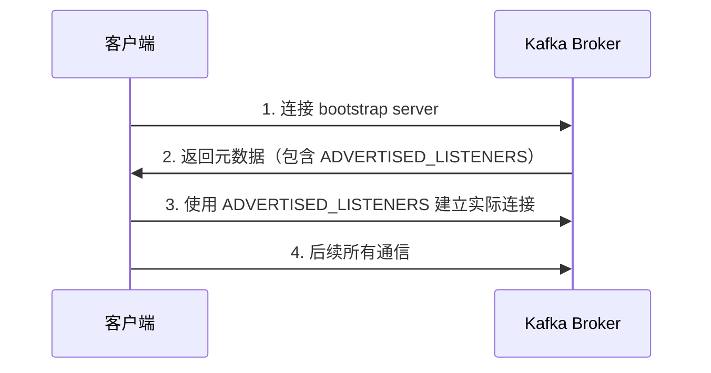

## 概述

在配置 Kafka 时，`KAFKA_LISTENERS` 和 `KAFKA_ADVERTISED_LISTENERS` 是两个容易混淆但非常重要的配置项。理解它们的区别对于正确部署 Kafka 集群至关重要，特别是在 Docker、Kubernetes 或云环境中。

## KAFKA_LISTENERS

### 定义

`KAFKA_LISTENERS` 定义了 Kafka broker **实际监听的网络接口和端口**。这是 Kafka 服务器绑定和接受连接的地址。

### 作用

- 指定 Kafka broker 在哪些网络接口上监听连接
- 控制 broker 实际绑定的 IP 地址和端口
- 决定了 broker 能从哪些网络接口接收请求

### 配置格式

```properties
KAFKA_LISTENERS=PLAINTEXT://0.0.0.0:9092,INTERNAL://0.0.0.0:9093
```

或者在 Docker Compose 中：

```yaml
environment:
  KAFKA_LISTENERS: PLAINTEXT://0.0.0.0:9092,INTERNAL://0.0.0.0:9093
```

### 常见配置

- `0.0.0.0` - 监听所有网络接口
- `localhost` - 仅监听本地回环接口
- 特定 IP - 仅监听指定的网络接口

## KAFKA_ADVERTISED_LISTENERS

### 定义

`KAFKA_ADVERTISED_LISTENERS` 定义了 Kafka broker **向客户端（生产者和消费者）广播的地址**。这是客户端用来连接 broker 的地址。

### 作用

- 告诉客户端应该使用什么地址来连接 broker
- 客户端会使用这个地址进行后续的数据传输
- 解决网络地址转换（NAT）和容器化环境的连接问题

### 配置格式

```properties
KAFKA_ADVERTISED_LISTENERS=PLAINTEXT://kafka-server:9092,INTERNAL://kafka-internal:9093
```

或者在 Docker Compose 中：

```yaml
environment:
  KAFKA_ADVERTISED_LISTENERS: PLAINTEXT://192.168.1.100:9092,INTERNAL://kafka:9093
```

## 核心区别对比

| 特性 | KAFKA_LISTENERS | KAFKA_ADVERTISED_LISTENERS |
|------|----------------|---------------------------|
| **用途** | Kafka 实际监听的地址 | 告诉客户端连接的地址 |
| **作用范围** | Broker 本地网络配置 | 客户端连接配置 |
| **典型值** | `0.0.0.0:9092` | 具体的主机名或 IP |
| **影响** | 决定 broker 能接收来自哪里的连接 | 决定客户端向哪里发起连接 |
| **必须配置** | 是 | 通常必须，尤其在容器或云环境 |

## 工作原理

### 连接流程

1. **初始连接**：客户端首先连接到 bootstrap server（可以是任何配置的地址）
2. **元数据获取**：broker 返回集群元数据，其中包含 `ADVERTISED_LISTENERS` 中配置的地址
3. **后续连接**：客户端使用从元数据中获取的地址（即 `ADVERTISED_LISTENERS`）进行后续所有的连接



## 常见使用场景

### 场景 1：本地开发环境

**配置示例：**

```yaml
environment:
  KAFKA_LISTENERS: PLAINTEXT://0.0.0.0:9092
  KAFKA_ADVERTISED_LISTENERS: PLAINTEXT://localhost:9092
```

**说明：**
- 监听所有接口，但广播 localhost
- 适合本地开发和测试

### 场景 2：Docker 环境（容器内外都需要访问）

**配置示例：**

```yaml
services:
  kafka:
    image: confluentinc/cp-kafka:latest
    ports:
      - "9092:9092"
    environment:
      KAFKA_LISTENERS: INTERNAL://0.0.0.0:9093,EXTERNAL://0.0.0.0:9092
      KAFKA_ADVERTISED_LISTENERS: INTERNAL://kafka:9093,EXTERNAL://localhost:9092
      KAFKA_LISTENER_SECURITY_PROTOCOL_MAP: INTERNAL:PLAINTEXT,EXTERNAL:PLAINTEXT
      KAFKA_INTER_BROKER_LISTENER_NAME: INTERNAL
```

**说明：**
- `INTERNAL` - 容器间通信使用 Docker 网络内部主机名
- `EXTERNAL` - 宿主机访问使用 localhost
- 支持容器内外的客户端同时访问

### 场景 3：云服务器部署

**配置示例：**

```yaml
environment:
  KAFKA_LISTENERS: PLAINTEXT://0.0.0.0:9092
  KAFKA_ADVERTISED_LISTENERS: PLAINTEXT://49.235.152.31:9092
```

**说明：**
- 监听所有接口
- 广播公网 IP，客户端使用公网 IP 连接

### 场景 4：Kubernetes 环境

**配置示例：**

```yaml
environment:
  KAFKA_LISTENERS: INTERNAL://0.0.0.0:9092,EXTERNAL://0.0.0.0:9093
  KAFKA_ADVERTISED_LISTENERS: INTERNAL://kafka-0.kafka-headless.default.svc.cluster.local:9092,EXTERNAL://kafka-node-1.example.com:9093
  KAFKA_LISTENER_SECURITY_PROTOCOL_MAP: INTERNAL:PLAINTEXT,EXTERNAL:PLAINTEXT
  KAFKA_INTER_BROKER_LISTENER_NAME: INTERNAL
```

**说明：**
- `INTERNAL` - 集群内部使用 Service DNS
- `EXTERNAL` - 集群外部使用 NodePort 或 LoadBalancer

## 常见问题与解决方案

### 问题 1：客户端连接超时

**症状：**
```
org.apache.kafka.common.errors.TimeoutException: Failed to update metadata after 60000 ms.
```

**原因：**
- `ADVERTISED_LISTENERS` 配置的地址客户端无法访问
- 网络隔离（如 Docker 容器网络）

**解决方案：**
```yaml
# 确保 ADVERTISED_LISTENERS 使用客户端可以访问的地址
KAFKA_ADVERTISED_LISTENERS: PLAINTEXT://宿主机IP:9092
```

### 问题 2：Docker 容器内可以连接，宿主机无法连接

**原因：**
- `ADVERTISED_LISTENERS` 使用了容器名称或容器内部 IP

**解决方案：**
```yaml
# 使用多个 listener
KAFKA_LISTENERS: INTERNAL://0.0.0.0:9093,EXTERNAL://0.0.0.0:9092
KAFKA_ADVERTISED_LISTENERS: INTERNAL://kafka:9093,EXTERNAL://localhost:9092
```

### 问题 3：集群节点之间无法通信

**原因：**
- broker 间通信的 listener 配置不正确
- `KAFKA_INTER_BROKER_LISTENER_NAME` 未正确指定

**解决方案：**
```yaml
KAFKA_LISTENER_SECURITY_PROTOCOL_MAP: INTERNAL:PLAINTEXT,EXTERNAL:PLAINTEXT
KAFKA_INTER_BROKER_LISTENER_NAME: INTERNAL
```

### 问题 4：连接成功但无法读写数据

**原因：**
- 初始连接成功（使用 bootstrap server），但后续连接失败
- `ADVERTISED_LISTENERS` 指向的地址在防火墙后或无法路由

**解决方案：**
```bash
# 测试客户端是否能访问 ADVERTISED_LISTENERS 的地址
telnet <advertised-host> <advertised-port>

# 如果无法访问，修改为客户端可达的地址
```

## 配置最佳实践

### 1. 明确网络拓扑

在配置前，先明确：
- 客户端在哪里（同一网络、不同网络、容器内外）
- 使用什么地址可以访问到 broker（IP、域名、容器名）
- 是否有 NAT、负载均衡器等网络设备

### 2. 使用多 Listener

```yaml
# 推荐配置：区分内外部访问
KAFKA_LISTENERS: INTERNAL://0.0.0.0:9093,EXTERNAL://0.0.0.0:9092
KAFKA_ADVERTISED_LISTENERS: INTERNAL://kafka:9093,EXTERNAL://192.168.1.100:9092
KAFKA_LISTENER_SECURITY_PROTOCOL_MAP: INTERNAL:PLAINTEXT,EXTERNAL:PLAINTEXT
KAFKA_INTER_BROKER_LISTENER_NAME: INTERNAL
```

### 3. 验证配置

```bash
# 1. 检查 broker 是否正确监听
netstat -tulpn | grep 9092

# 2. 从客户端位置测试连接
telnet <advertised-host> <advertised-port>

# 3. 使用 kafka 工具验证
kafka-broker-api-versions --bootstrap-server <advertised-host>:<advertised-port>
```

### 4. 日志排查

```bash
# 查看 Kafka 日志中的网络配置信息
docker logs kafka 2>&1 | grep -i "advertised"
docker logs kafka 2>&1 | grep -i "listener"
```

## 完整配置示例

### Docker Compose 完整配置

```yaml
version: '3'
services:
  zookeeper:
    image: confluentinc/cp-zookeeper:latest
    environment:
      ZOOKEEPER_CLIENT_PORT: 2181
      ZOOKEEPER_TICK_TIME: 2000

  kafka:
    image: confluentinc/cp-kafka:latest
    depends_on:
      - zookeeper
    ports:
      - "9092:9092"
      - "9093:9093"
    environment:
      # 监听配置：在所有接口上监听
      KAFKA_LISTENERS: INTERNAL://0.0.0.0:9093,EXTERNAL://0.0.0.0:9092
      
      # 广播配置：告诉客户端连接地址
      # INTERNAL: 容器间使用容器名
      # EXTERNAL: 宿主机使用 localhost 或宿主机 IP
      KAFKA_ADVERTISED_LISTENERS: INTERNAL://kafka:9093,EXTERNAL://localhost:9092
      
      # 监听器安全协议映射
      KAFKA_LISTENER_SECURITY_PROTOCOL_MAP: INTERNAL:PLAINTEXT,EXTERNAL:PLAINTEXT
      
      # broker 间通信使用 INTERNAL
      KAFKA_INTER_BROKER_LISTENER_NAME: INTERNAL
      
      # Zookeeper 配置
      KAFKA_ZOOKEEPER_CONNECT: zookeeper:2181
      
      # 其他配置
      KAFKA_OFFSETS_TOPIC_REPLICATION_FACTOR: 1
      KAFKA_TRANSACTION_STATE_LOG_MIN_ISR: 1
      KAFKA_TRANSACTION_STATE_LOG_REPLICATION_FACTOR: 1
```

### 生产环境配置（多 broker）

```yaml
kafka-1:
  environment:
    KAFKA_BROKER_ID: 1
    KAFKA_LISTENERS: INTERNAL://0.0.0.0:9093,EXTERNAL://0.0.0.0:9092
    KAFKA_ADVERTISED_LISTENERS: INTERNAL://kafka-1:9093,EXTERNAL://node1.example.com:9092
    KAFKA_LISTENER_SECURITY_PROTOCOL_MAP: INTERNAL:PLAINTEXT,EXTERNAL:PLAINTEXT
    KAFKA_INTER_BROKER_LISTENER_NAME: INTERNAL
    KAFKA_ZOOKEEPER_CONNECT: zk-1:2181,zk-2:2181,zk-3:2181

kafka-2:
  environment:
    KAFKA_BROKER_ID: 2
    KAFKA_LISTENERS: INTERNAL://0.0.0.0:9093,EXTERNAL://0.0.0.0:9092
    KAFKA_ADVERTISED_LISTENERS: INTERNAL://kafka-2:9093,EXTERNAL://node2.example.com:9092
    KAFKA_LISTENER_SECURITY_PROTOCOL_MAP: INTERNAL:PLAINTEXT,EXTERNAL:PLAINTEXT
    KAFKA_INTER_BROKER_LISTENER_NAME: INTERNAL
    KAFKA_ZOOKEEPER_CONNECT: zk-1:2181,zk-2:2181,zk-3:2181
```

## 客户端连接示例

### Python 客户端

```python
from kafka import KafkaProducer, KafkaConsumer

# 使用 ADVERTISED_LISTENERS 中配置的地址
producer = KafkaProducer(
    bootstrap_servers=['localhost:9092'],  # 或 '49.235.152.31:9092'
    value_serializer=lambda v: json.dumps(v).encode('utf-8')
)

consumer = KafkaConsumer(
    'my-topic',
    bootstrap_servers=['localhost:9092'],
    value_deserializer=lambda m: json.loads(m.decode('utf-8'))
)
```

### Java 客户端

```java
Properties props = new Properties();
// 使用 ADVERTISED_LISTENERS 中配置的地址
props.put("bootstrap.servers", "localhost:9092");
props.put("key.serializer", "org.apache.kafka.common.serialization.StringSerializer");
props.put("value.serializer", "org.apache.kafka.common.serialization.StringSerializer");

KafkaProducer<String, String> producer = new KafkaProducer<>(props);
```

## 调试技巧

### 1. 查看 Kafka 实际监听的端口

```bash
docker exec kafka netstat -tulpn | grep LISTEN
```

### 2. 查看 Kafka 配置

```bash
docker exec kafka cat /etc/kafka/server.properties | grep -i listener
```

### 3. 测试元数据响应

```bash
# 使用 kafka-metadata-shell 查看 broker 返回的元数据
kafka-metadata-shell --snapshot /tmp/metadata-snapshot --print
```

### 4. 使用 tcpdump 抓包分析

```bash
# 捕获 Kafka 端口的流量
tcpdump -i any -nn port 9092 -A
```

## 总结

### 关键要点

1. **LISTENERS**：Kafka 真正监听的地址（服务端配置）
2. **ADVERTISED_LISTENERS**：Kafka 告诉客户端的地址（客户端使用）
3. 两者可以不同，这是为了解决 NAT、容器化等场景的网络问题
4. 客户端最终使用的是 `ADVERTISED_LISTENERS` 中的地址

### 配置原则

- `LISTENERS` 通常使用 `0.0.0.0` 监听所有接口
- `ADVERTISED_LISTENERS` 必须使用客户端能够访问的具体地址
- 复杂网络环境建议使用多 listener 配置
- 始终验证客户端能否访问 `ADVERTISED_LISTENERS` 配置的地址

### 记忆口诀

> **LISTENERS** = "我在哪里听"  
> **ADVERTISED_LISTENERS** = "我告诉你来哪里找我"

理解这两个配置的区别，是正确部署和使用 Kafka 的关键。希望这篇文档能帮助你避免常见的配置陷阱！

