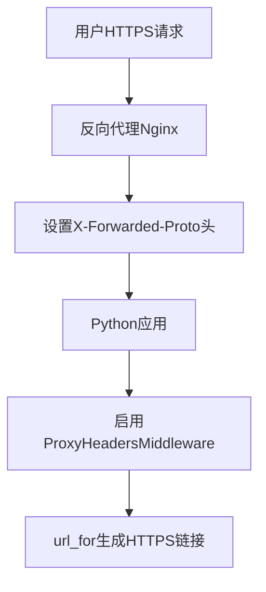

# Python中url_for生成链接的HTTP/HTTPS问题详解

## 问题背景

在使用FastAPI、Flask等Python Web框架时，经常会遇到`url_for()`函数生成的链接是HTTP而不是HTTPS的问题。特别是在生产环境中使用反向代理（如Nginx、ALB等）时，这个问题更加常见。本文将深入解析这个问题的根本原因，并提供完整的解决方案。

## 核心原理

### url_for的工作原理

`url_for()`（或`request.url_for()`）函数基于当前请求对象的协议与主机信息生成绝对URL：

```python
# FastAPI示例
from fastapi import FastAPI, Request

app = FastAPI()

@app.get("/login")
def login():
    # 这个URL的协议取决于request.url.scheme
    login_url = request.url_for("login")
    return {"login_url": login_url}
```

### 协议来源机制

1. **默认情况**：应用直连 → `scheme = "http"`
2. **反向代理场景**：应用与代理之间多为明文HTTP
3. **协议识别**：协议取自`request.url.scheme`（对应ASGI的`scope['scheme']`）

## 问题根源分析

### 反向代理架构下的问题

```
用户 → HTTPS → 反向代理 → HTTP → Python应用
```

在这种架构下：
- 用户通过HTTPS访问
- 反向代理与Python应用之间使用HTTP通信
- 如果不正确处理代理头，应用会误认为请求是HTTP

### 关键请求头

反向代理需要正确传递以下请求头：

```http
X-Forwarded-Proto: https
X-Forwarded-Host: example.com
X-Forwarded-Port: 443
X-Forwarded-For: 192.168.1.1
```

## 完整解决方案

### 方案一：代码配置（推荐）

#### FastAPI配置
```python
# main.py
from fastapi import FastAPI
from uvicorn.middleware.proxy_headers import ProxyHeadersMiddleware

app = FastAPI()

# 添加代理头中间件
# 生产环境请将 "*" 改为具体的反向代理IP/网段
app.add_middleware(
    ProxyHeadersMiddleware, 
    trusted_hosts="*"  # 生产环境改为 "127.0.0.1,10.0.0.0/8"
)
```

#### Flask配置
```python
# app.py
from flask import Flask
from werkzeug.middleware.proxy_fix import ProxyFix

app = Flask(__name__)

# 配置代理头处理
app.wsgi_app = ProxyFix(
    app.wsgi_app,
    x_for=1,
    x_proto=1,
    x_host=1,
    x_port=1
)
```

### 方案二：启动参数配置

#### Uvicorn启动参数
```bash
uvicorn main:app --host 0.0.0.0 --port 80 \
  --proxy-headers --forwarded-allow-ips="*"
```

#### Gunicorn配置
```python
# gunicorn.conf.py
forwarded_allow_ips = "*"
secure_scheme_headers = {
    'X-FORWARDED-PROTOCOL': 'ssl',
    'X-FORWARDED-PROTO': 'https',
    'X-FORWARDED-SSL': 'on'
}
```

## 反向代理配置

### Nginx配置示例

```nginx
server {
    listen 443 ssl;
    server_name example.com;
    
    # SSL配置
    ssl_certificate /path/to/cert.pem;
    ssl_certificate_key /path/to/key.pem;
    
    location / {
        proxy_pass http://127.0.0.1:8000;
        
        # 关键：传递协议信息
        proxy_set_header X-Forwarded-Proto $scheme;
        proxy_set_header X-Forwarded-Host  $host;
        proxy_set_header X-Forwarded-Port  $server_port;
        proxy_set_header X-Forwarded-For   $proxy_add_x_forwarded_for;
        
        # 如果有统一前缀
        proxy_set_header X-Forwarded-Prefix /api;
    }
}
```

### Apache配置示例

```apache
<VirtualHost *:443>
    ServerName example.com
    SSLEngine on
    SSLCertificateFile /path/to/cert.pem
    SSLCertificateKeyFile /path/to/key.pem
    
    ProxyPreserveHost On
    ProxyPass / http://127.0.0.1:8000/
    ProxyPassReverse / http://127.0.0.1:8000/
    
    # 传递协议信息
    RequestHeader set X-Forwarded-Proto "https"
    RequestHeader set X-Forwarded-Port "443"
</VirtualHost>
```

## 验证和调试

### 调试端点

添加一个调试端点来验证配置是否生效：

```python
@app.get("/_debug/request")
def debug_request(request: Request):
    """调试端点 - 仅在测试环境使用"""
    return {
        "scheme": request.url.scheme,
        "url": str(request.url),
        "base_url": str(request.base_url),
        "headers": {
            k.decode(): v.decode() 
            for k, v in request.scope.get("headers", [])
        },
        "forwarded_proto": request.headers.get("x-forwarded-proto"),
    }
```

### 验证步骤

1. 访问调试端点：`https://yourdomain.com/_debug/request`
2. 检查返回的`scheme`字段是否为`https`
3. 如果`scheme`为`https`，则`url_for()`会正确生成HTTPS链接

## 临时解决方案

### 模板中的临时处理

#### 方案一：使用相对路径
```html
<!-- 浏览器会继承当前页面的协议 -->
<a href="{{ request.app.url_path_for('login') }}">登录</a>
```

#### 方案二：强制HTTPS
```html
<!-- 强制使用HTTPS协议 -->
<a href="{{ request.url_for('login').replace(scheme='https') }}">登录</a>
```

#### 方案三：模板过滤器
```python
# 创建自定义过滤器
@app.template_filter('force_https')
def force_https(url):
    return str(url).replace('http://', 'https://')

# 在模板中使用
<a href="{{ request.url_for('login') | force_https }}">登录</a>
```

## 常见误区和陷阱

### ❌ 错误理解

1. **仅设置root_path无法解决协议问题**
   ```python
   # 这样设置不会影响HTTP/HTTPS
   app = FastAPI(root_path="/api")
   ```

2. **只在代理端设置头信息不够**
   - 代理端设置了`X-Forwarded-Proto`
   - 但应用端没有启用代理头处理
   - 结果仍然是HTTP

3. **页面本身是HTTPS不等于链接自动变HTTPS**
   - 使用`url_for()`生成绝对URL
   - 页面是HTTPS，但链接可能仍是HTTP
   - 只有相对路径才会继承页面协议

### ✅ 正确做法

1. **完整的代理头配置**
   ```python
   # 代理端：正确传递头信息
   # 应用端：信任并处理头信息
   ```

2. **使用相对路径作为备选方案**
   ```html
   <!-- 更通用的做法 -->
   <a href="{{ request.app.url_path_for('login') }}">登录</a>
   ```

## 不同框架的配置对比

| 框架 | 中间件/配置 | 启动参数 |
|------|-------------|----------|
| **FastAPI** | `ProxyHeadersMiddleware` | `--proxy-headers` |
| **Flask** | `ProxyFix` | 无直接支持 |
| **Django** | `SECURE_PROXY_SSL_HEADER` | 无直接支持 |
| **Starlette** | `ProxyHeadersMiddleware` | `--proxy-headers` |

### 具体配置示例

#### Django配置
```python
# settings.py
SECURE_PROXY_SSL_HEADER = ('HTTP_X_FORWARDED_PROTO', 'https')
USE_TLS = True
```

#### Starlette配置
```python
from starlette.middleware import Middleware
from starlette.middleware.trustedhost import TrustedHostMiddleware

app = Starlette(middleware=[
    Middleware(TrustedHostMiddleware, allowed_hosts=["*"]),
])
```

## 最佳实践总结

### 1. 完整的配置流程



### 2. 安全考虑

```python
# 生产环境的安全配置
app.add_middleware(
    ProxyHeadersMiddleware, 
    trusted_hosts=["127.0.0.1", "10.0.0.0/8", "172.16.0.0/12"]
)
```

### 3. 职责分离

- **API层版本前缀**：使用路由`prefix`控制
- **部署入口前缀**：使用`root_path`控制
- **协议处理**：通过代理头中间件统一处理

### 4. 监控和日志

```python
import logging

logger = logging.getLogger(__name__)

@app.middleware("http")
async def log_requests(request: Request, call_next):
    logger.info(f"Request scheme: {request.url.scheme}")
    logger.info(f"Forwarded proto: {request.headers.get('x-forwarded-proto')}")
    response = await call_next(request)
    return response
```

## 故障排查指南

### 问题诊断步骤

1. **检查代理头传递**
   ```bash
   curl -H "X-Forwarded-Proto: https" http://localhost:8000/_debug/request
   ```

2. **验证中间件配置**
   ```python
   # 检查中间件是否正确添加
   print(app.user_middleware)
   ```

3. **测试不同场景**
   - 直连应用：`http://localhost:8000`
   - 通过代理：`https://yourdomain.com`

### 常见错误信息

```python
# 错误：trusted_hosts配置不当
ValueError: Invalid trusted_hosts: "*"

# 解决：使用具体的IP或网段
trusted_hosts=["127.0.0.1", "10.0.0.0/8"]
```

## 总结

`url_for()`生成HTTP还是HTTPS链接的问题，本质上是一个协议识别和传递的问题。解决这个问题的关键在于：

1. **反向代理正确传递协议信息**
2. **应用端信任并处理代理头**
3. **使用相对路径作为备选方案**

通过正确配置代理头中间件，可以确保`url_for()`函数稳定地生成HTTPS链接，与用户的HTTPS访问保持一致。这不仅解决了链接协议问题，还提升了应用的安全性和用户体验。

---

*在生产环境中，请务必注意安全配置，避免使用过于宽松的`trusted_hosts`设置。*