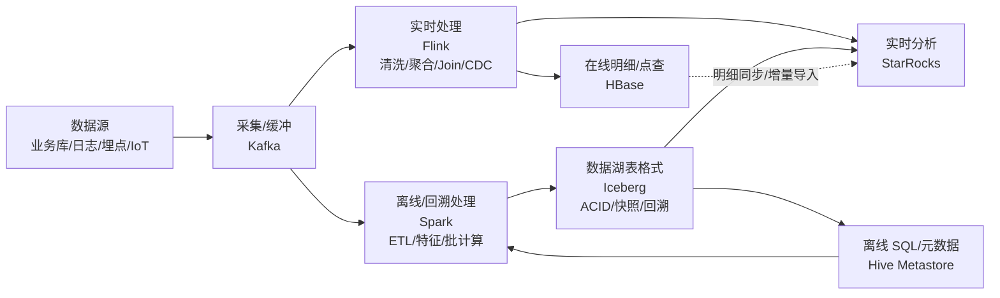

# 大数据基础组件速览

按「大数据概念」+「HBase / StarRocks / Iceberg / Hive / Spark / Flink」分别说明：它是什么、强项在哪、适合做什么。

## 大数据（概念）
- **定位**：处理“规模大、增长快、类型多”的数据体系与工程方法集合，不是单一产品。
- **核心诉求**：
  - **存得下**：分布式存储（HDFS / 对象存储）+ 冗余容灾。
  - **算得动**：分布式计算（Spark / Flink）+ 资源调度（YARN / K8s）。
  - **用得快**：查询与服务化（StarRocks / Trino / Elasticsearch 等）。
- **适用场景**：日志/埋点分析、推荐与画像、实时风控、离线报表、湖仓一体。

## HBase
- **定位**：分布式、面向列的 NoSQL（宽表/KV），擅长**海量明细的随机读写**与按主键查询；底层通常落在 HDFS。
- **特点**：
  - **数据模型**：`RowKey + ColumnFamily + Qualifier + Timestamp`，按 `RowKey` 有序，天然多版本。
  - **性能**：毫秒级点查/写入吞吐强，可水平扩展；但全表扫描/多维分析不擅长。
  - **一致性**：单行强一致（常见理解：单 `RowKey` 操作原子），跨行事务能力有限。
- **适用场景**：用户画像明细、订单/设备/日志明细、时序数据明细、需要主键快速读写的在线存储。
- **不适合**：复杂 JOIN、即席多维聚合、需要强事务的 OLTP；此类通常交给 OLAP/关系型或通过同步到分析引擎解决。
- **关键设计**：`RowKey` 防热点（盐值/散列前缀/反转等），关注 RegionSplit 与 Compaction。

## StarRocks
- **定位**：MPP 列式 **OLAP 实时分析数据库**，擅长多维聚合、即席查询、报表看板。
- **特点**：
  - **执行与存储**：列式 + 向量化执行 + 并行计算，面向分析型 SQL 优化。
  - **导入**：支持从 Kafka 持续导入（Routine Load）/ HTTP 导入（Stream Load）等，适合准实时入仓。
  - **表模型**：Primary Key（UPSERT/去重，适合明细修正）、Duplicate Key（保留全量明细）、Aggregate Key（预聚合）。
- **适用场景**：运营/埋点看板、实时数仓 ADS 层、用户/商品多维分析、交互式分析查询（秒级甚至亚秒）。
- **不适合**：大量高频点更新的 OLTP（如强事务订单系统），或超高并发 KV 点查（更像 HBase/Redis 的地盘）。

## Iceberg
- **定位**：数据湖的**表格格式（Table Format）**，让“对象存储/DFS 上的 Parquet/ORC/Avro 文件”具备表语义：ACID、版本、Schema 演进、分区演进。
- **特点**：
  - **快照与时光回溯**：每次写入生成新的 Snapshot，可按版本/时间查询与回滚。
  - **ACID（快照隔离）**：通过元数据与原子提交实现一致性，适合并发写入与读写隔离。
  - **生态兼容**：可被 Spark、Flink、Trino/Presto、Hive 等计算/查询引擎读取与写入（具体取决于集成方式）。
  - **元数据组织**：通过 metadata / manifest 管理数据文件与统计信息，加速分区裁剪与查询规划。
- **适用场景**：湖仓一体（离线 + 准实时）、统一存储明细事实表、增量入湖与回溯审计、跨引擎共享同一份数据。
- **不适合**：极低延迟的在线点查服务（它是“表格式+文件”，不是 KV 引擎）。

## Hive
- **定位**：传统离线数仓体系中的 SQL 层与元数据中心（Hive Metastore）；计算通常交给 MR/Tez/Spark 等。
- **特点**：
  - **优势**：SQL 生态成熟、适合离线批处理、与 HDFS/对象存储深度结合。
  - **限制**：交互式低延迟不强（需搭配 Presto/Trino/StarRocks 等），对实时流处理不是主场。
- **适用场景**：离线数仓 DWD/DWS 构建、T+1 报表、数据治理（元数据/分区管理）。
- **不适合**：秒级交互分析、复杂实时链路（更适合 Flink/OLAP）。

## Spark
- **定位**：通用分布式计算引擎，强项在**离线批处理**与大规模数据 ETL；也支持流处理（Structured Streaming）。
- **特点**：
  - **生态**：Spark SQL、MLlib、GraphX，适合统一处理 ETL + 分析 + 机器学习特征工程。
  - **执行**：偏微批/批式思维更强，适合大吞吐任务与复杂转换。
- **适用场景**：离线 ETL、宽表加工、特征工程、批量回填、离线指标计算；配合 Iceberg/Hive 构建湖/仓表。
- **不适合**：严格低延迟、事件时间复杂、超大状态的实时流（通常 Flink 更合适）。

## Flink
- **定位**：流式优先的分布式计算引擎，强项在**低延迟实时处理**、复杂事件处理与有状态计算。
- **特点**：
  - **流式模型**：原生流处理，支持事件时间、Watermark、窗口、Join、CDC 等。
  - **一致性**：通过 Checkpoint 与状态后端实现端到端一致性（取决于 Source/Sink 配置）。
  - **实时数仓**：常用来做 Kafka → 清洗/聚合 → 写入 StarRocks/Iceberg/HBase。
- **适用场景**：实时 ETL、实时指标、风控规则、实时画像/特征、CDC 入湖/入仓。
- **不适合**：纯离线批任务（Spark 更经济/简单时常更合适），或无状态简单转发（可能 Kafka Streams 就够）。

## 快速选型（对照表心法）
- **点查/明细随机读写**：HBase
- **多维分析/报表看板**：StarRocks
- **统一存储、回溯、跨引擎共享（湖）**：Iceberg
- **离线 SQL 数仓与元数据**：Hive
- **离线大规模 ETL/计算**：Spark
- **低延迟实时链路/有状态流处理**：Flink

## 一张图看懂它们怎么串起来



如果你的博客渲染不支持 `mermaid`，可以用这张纯文本图理解同样的链路：

```text
数据源(业务库/日志/埋点/IoT)
  │
  ▼
Kafka(采集/缓冲)
  ├─► Flink(实时清洗/聚合/Join/CDC) ─► HBase(在线明细/点查)
  │                                   └─► StarRocks(实时OLAP/看板)
  └─► Spark(离线ETL/批计算/回填) ─► Iceberg(湖表：ACID/快照/回溯)
                                      ├─► Hive Metastore(离线SQL/元数据)
                                      └─► StarRocks(分析加速/交互查询)
```

